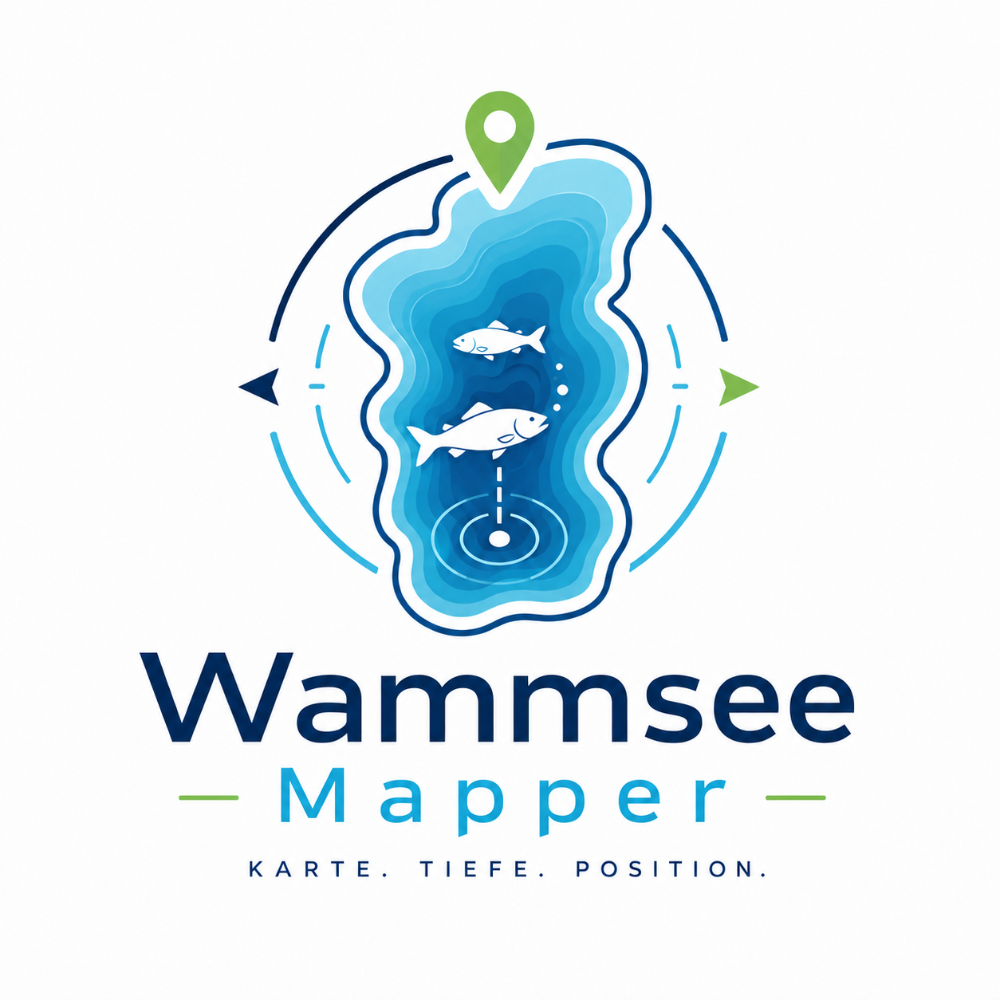
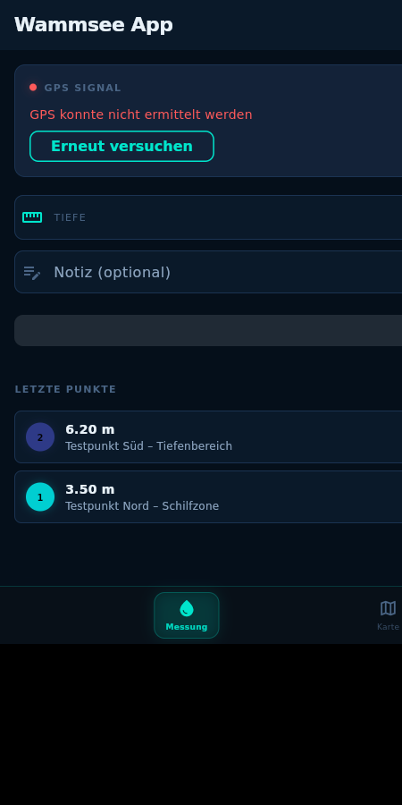
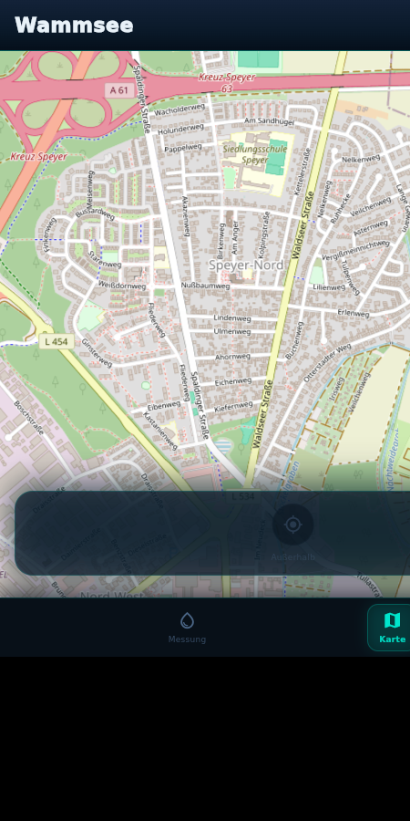
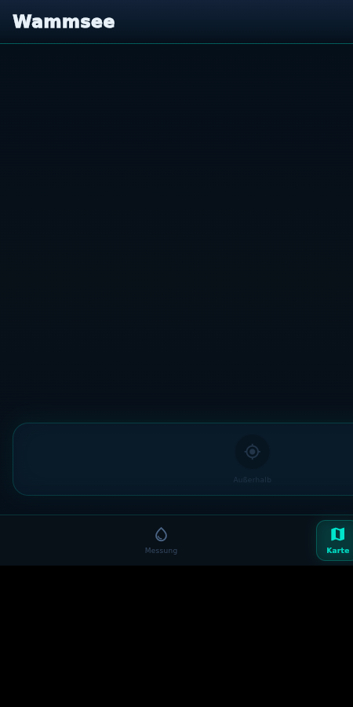
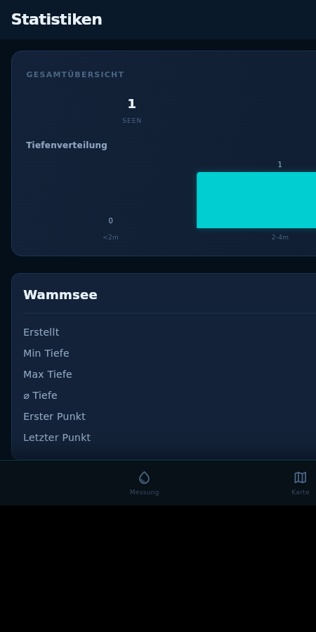

# 🗺️ Lake Mapper



**Flutter-App für Bathymetrie-Kartierung mit Cloud-Sync**

Premium Nautical Interface — dunkles Navy-Design, Cyan-Glow, Bathymetrie-Sonaransicht.

---

## Was das ist

Mobile App zum Aufnehmen von Tiefenmessungen mit GPS-Koordinaten. Daten werden lokal gespeichert und können mit einem Server synchronisiert werden. Hardcoded auf den **Wammsee** (Speyer) — kein Multi-See-Support nötig.

---

## Features

| Feature | Status |
|---------|--------|
| GPS-Tracking mit Genauigkeitsanzeige | ✅ |
| Tiefeneingabe mit Notiz | ✅ |
| Lokale SQLite-Datenbank | ✅ |
| Live-Karte (flutter_map) mit OSM | ✅ |
| Farbcodierung nach Tiefe | ✅ |
| Punktnummer (automatisch) | ✅ |
| Letzten Punkt duplizieren | ✅ |
| GPS-Warnung bei Ungenauigkeit | ✅ |
| Punkt bearbeiten / löschen (Karte & Home) | ✅ |
| CSV / GeoJSON Export | ✅ |
| Cloud-Sync (arxlabs.dev) | ✅ |
| Offline/Online-Modus | ✅ |
| Legende auf Karte | ✅ |
| **Bathymetrie-/Sonaransicht (Abyss-Modus)** | ✅ |
| **Premium Nautical UI (Glassmorphism, Cyan-Glow)** | ✅ |
| **Testdaten-Seeding beim ersten Start** | ✅ |

---

## Screenshots

| HomeScreen | Kartenmodus |
|:---:|:---:|
|  |  |

| Bathymetrie-Modus | Statistiken |
|:---:|:---:|
|  |  |

---

## Design

Luxury Nautical Instrument Interface:
- Dunkles Navy mit Cyan-Glow
- Glassmorphism-Panels (transparenter Navy-Hintergrund + Cyan-Rand)
- Bathymetrische Farbskala: Cyan → Teal → Indigo → Violett
- RobotoMono für Instrumenten-Anzeigen, Inter für UI-Text

---

## Installation

```bash
# Flutter-App
cd lake_mapper_app
flutter pub get
flutter run

# Release-Build
flutter build apk --release
# Ausgabe: build/app/outputs/flutter-apk/app-release.apk

# Server (optional)
cd server
npm start
```

---

## Tech-Stack

- **App**: Flutter + flutter_map + geolocator + sqflite
- **State**: StatefulWidget + DataRefreshService (ChangeNotifier)
- **Theme**: Custom dark theme (AppColors + AppTheme)
- **Server**: Node.js (JSON-Files)
- **Sync**: REST API an arxlabs.dev/lakedb/{datenbankname}

---

## Server installieren

```bash
cd server
PORT=3000 node server.js
```

Datenbank-Verzeichnis: `./data/{name}.json`

---

## API

| Methode | Endpoint | Beschreibung |
|---------|----------|-------------|
| GET | /health | Health-Check |
| GET | /{db}/all | Alle Daten |
| POST | /{db}/depth_points | Messpunkt anlegen |
| PUT | /{db}/depth_points/{id} | Aktualisieren |
| DELETE | /{db}/depth_points/{id} | Löschen |

---

## Projektstruktur

```
lake_map/
├── lake_mapper_app/           # Flutter-App
│   └── lib/
│       ├── main.dart
│       ├── database/          # SQLite (AppDatabase)
│       ├── models/            # Lake, DepthPoint
│       ├── services/          # Location, Sync, Export, Auth, DataRefresh
│       ├── screens/           # Home, Map, Stats, Export, Settings
│       ├── theme/             # AppColors, AppTheme
│       ├── data/              # wammsee_polygon.dart
│       └── widgets/           # MainShell
├── server/                    # Node.js Server
│   ├── server.js
│   ├── package.json
│   └── README.md
├── images/                    # Logo, Screenshots
├── roadmap.md
├── verbesserungen.md
└── README.md
```

---

## Lizenz

MIT
